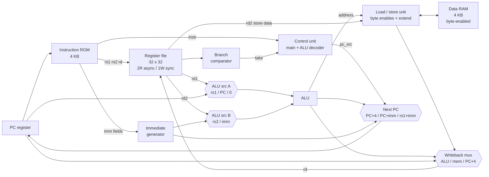

# Single-Cycle RV32I CPU on the Basys 3

A synthesizable single-cycle RISC-V processor written from scratch in Verilog-2001,
running C compiled by `riscv32-unknown-elf-gcc` on a Digilent Basys 3
(Xilinx Artix-7 XC7A35T).

Implements the **full RV32I base integer ISA** — 37 instructions — excluding
`FENCE`, `ECALL`, `EBREAK`, and the Zicsr CSR extension.

---

## Status

| Check | Result |
|---|---|
| ALU directed unit test | 16/16 pass |
| ISA self-test (`sw/test.S`) | 34/34 sub-tests pass, 185 cycles |
| gcc `-march=rv32i -mabi=ilp32` C program | runs correctly in RTL simulation |
| Yosys structural check | pass, no driverless or multiply-driven nets |
| Inferred latches | **0** |
| Artix-7 technology mapping | ~1000 LUT, 85 FF, 128 RAM256X1S, 12 RAM32M |
| Vivado timing closure | *not yet run* — `scripts/build_vivado.tcl` |
| Hardware bring-up on Basys 3 | *not yet run* |

Utilization is roughly 5% of the XC7A35T's 20,800 LUTs. Note that the
instruction ROM constant-folds against whatever program image is loaded, so
LUT count grows with program size — the number above is for `sw/main.c`.

Everything above the horizontal break is reproducible with `./scripts/run_sim.sh`
and `./scripts/lint_yosys.sh`. The last two rows require Vivado and the board.

---

## Architecture



One instruction retires per clock. There is no pipeline, so there are no
hazards, no forwarding, and no stalls — and the clock period has to cover the
entire fetch→decode→read→execute→memory→writeback path.

### Design decisions worth defending

- **Asynchronous-read memories.** A single-cycle machine cannot tolerate a
  registered memory read, so `imem` and `dmem` use combinational reads. On the
  Artix-7 this maps to LUT-based ROM and distributed RAM (LUTRAM), not block
  RAM. This is the real cost of the single-cycle architecture and it is why
  memories are capped at 4 KB each.
- **Dedicated branch comparator.** Branches are resolved by `branch_unit.v`
  reading the register file directly rather than by reusing the ALU's zero
  flag. It costs one extra comparator and buys a shorter control path plus
  free `BLT`/`BGE`/`BLTU`/`BGEU`.
- **LUI via the ALU.** `LUI` is `0 + U-immediate`, so it reuses the adder
  through a third input on the ALU-A mux instead of needing its own path.
- **Separate load/store alignment unit.** `lsu.v` produces byte-enables for
  `SB`/`SH` and does lane selection plus sign/zero extension for
  `LB`/`LH`/`LBU`/`LHU`. Keeping it out of the core makes the datapath
  readable.
- **Divided CPU clock with a declared generated clock.** The board gives
  100 MHz; the CPU runs at 12.5 MHz off a BUFG, and `constr/Basys3.xdc`
  declares that generated clock so timing is analysed against the real 80 ns
  period.

---

## Instruction set

| Format | Instructions |
|---|---|
| R-type | `ADD` `SUB` `SLL` `SLT` `SLTU` `XOR` `SRL` `SRA` `OR` `AND` |
| I-type ALU | `ADDI` `SLTI` `SLTIU` `XORI` `ORI` `ANDI` `SLLI` `SRLI` `SRAI` |
| Load | `LB` `LH` `LW` `LBU` `LHU` |
| Store | `SB` `SH` `SW` |
| Branch | `BEQ` `BNE` `BLT` `BGE` `BLTU` `BGEU` |
| Jump | `JAL` `JALR` |
| Upper immediate | `LUI` `AUIPC` |

> **Why not the ten-instruction subset most tutorials stop at?** Because a
> compiler will not cooperate. `riscv32-unknown-elf-gcc` emits `LUI`, `AUIPC`,
> `JALR`, `BNE`, `BGEU`, `SLLI`, `SRAI`, `SB`, and `LBU` in the first twenty
> instructions of any C program. Running real compiled code requires the whole
> base ISA.

---

## Memory map

| Range | Device | Notes |
|---|---|---|
| `0x0000_0000 – 0x0000_0FFF` | Instruction ROM | 4 KB, initialized from `imem.hex` |
| `0x1000_0000 – 0x1000_0FFF` | Data RAM | 4 KB, byte-enabled, from `dmem.hex` |
| `0x2000_0000` | LED register | write, low 16 bits |
| `0x2000_0004` | Switch input | read, low 16 bits |
| `0x2000_0008` | 7-segment value | write, low 16 bits |

Reset PC is `0x0000_0000`. The stack pointer starts at `0x1000_1000` and grows
down. `.text` lives in ROM; `.rodata`, `.data`, `.bss`, and the stack live in
RAM.

---

## Repository layout

```
rtl/          Verilog source
  rv32i_defs.vh    shared opcode / control encodings
  alu.v            32-bit ALU
  alu_decoder.v    funct3 + funct7[5] -> ALU control
  main_decoder.v   opcode -> control signals
  controller.v     control unit (both decoders + next-PC select)
  regfile.v        32 x 32 register file
  extend.v         immediate generator (I S B U J)
  branch_unit.v    branch condition comparator
  lsu.v            load/store alignment and byte enables
  imem.v           instruction ROM
  dmem.v           data RAM with byte write enables
  riscv_core.v     datapath + control  <- the CPU
  riscv_soc.v      core + memories + memory-mapped I/O
  seg7.v           4-digit hex display driver
  top_basys3.v     board wrapper (clocking, reset, pins)

sim/          testbenches
  tb_alu.v              directed ALU unit test
  tb_riscv_soc.v        runs sw/test.S, self-checking
  tb_riscv_soc_prog.v   runs the gcc-compiled C demo

sw/           software
  link.ld       memory layout
  crt0.S        reset vector, stack setup, .bss clear
  main.c        demo: Fibonacci table, switches select, hex display out
  test.S        34-case ISA self-test
  Makefile      builds imem.hex / dmem.hex

tools/        bin2hex.py -- flat binary to $readmemh word list
constr/       Basys3.xdc
scripts/
  find_toolchain.sh locate and verify a usable RISC-V GCC
  run_sim.sh        build software, run every testbench
  lint_yosys.sh     latch check + Artix-7 mapping estimate
  build_vivado.tcl  non-project synthesis -> bitstream
  publish.sh        first push to GitHub
```

---

## Build and run

### 1. Prerequisites

**To synthesize and run on hardware you need only Vivado.** `sw/imem.hex` and
`sw/dmem.hex` are committed, so the FPGA build has everything it needs.

Optional, and only if you want to change the software or re-run verification:

| Tool | Needed for |
|---|---|
| RISC-V GCC | rebuilding `imem.hex` / `dmem.hex` from `main.c` |
| Icarus Verilog (`iverilog`) | running the testbenches |
| Yosys | the pre-synthesis latch/mapping lint |
| Python 3 | `tools/bin2hex.py` |

### Getting a RISC-V toolchain

RISC-V GCC ships under several different names depending on who built it.
`./scripts/find_toolchain.sh` scans your PATH, test-compiles for
`rv32i`/`ilp32`, and tells you which prefix works. `sw/Makefile` auto-detects
it too, so `make` usually just works.

| Prefix | Where it comes from |
|---|---|
| `riscv64-unknown-elf-` | Ubuntu/Debian `apt`, riscv-gnu-toolchain |
| `riscv32-unknown-elf-` | riscv-gnu-toolchain built for 32-bit |
| `riscv-none-elf-` | xPack GNU RISC-V Embedded GCC |
| `riscv64-elf-` | Homebrew, Arch Linux |

**Ubuntu / Debian / WSL** — one command, this is the easy path:

```bash
sudo apt update && sudo apt install -y gcc-riscv64-unknown-elf
```

**Windows, native (no WSL)** — xPack ships a prebuilt zip. Download the latest
`riscv-none-elf-gcc-*-win32-x64.zip` from
<https://github.com/xpack-dev-tools/riscv-none-elf-gcc-xpack/releases>,
extract to `C:\riscv`, and add `C:\riscv\bin` to your PATH. The prefix is
`riscv-none-elf-`.

**macOS**

```bash
brew tap riscv-software-src/riscv
brew install riscv-tools          # prefix: riscv64-unknown-elf-
```

Verify with `./scripts/find_toolchain.sh` or `make -C sw toolchain`.

- Vivado 2024.2 for synthesis and the bitstream.

### 2. Build the software

Only needed if you changed `main.c` or `test.S` — the `.hex` files are
already in the repo.

```bash
cd sw
make toolchain            # show which compiler was auto-detected
make                      # -> imem.hex, dmem.hex, prog.lst
make test                 # -> imem_test.hex, dmem_test.hex
make CROSS=riscv-none-elf- all    # override the prefix if auto-detect misses
```

### 3. Simulate and lint

```bash
./scripts/run_sim.sh          # all three testbenches
./scripts/lint_yosys.sh       # latch check + Artix-7 mapping estimate
```

Expected output:

```
--- alu unit test ---
  alu: all cases passed

 single-cycle RV32I -- ISA self-test
  ALL TESTS PASSED   (185 cycles)

 single-cycle RV32I -- running gcc-compiled C
  Fibonacci table in RAM matches (24 entries)
  ok:   sw=23  hex=6ff1  (fib[23])
  C PROGRAM RAN CORRECTLY
```

Add `+TRACE` to `vvp` for an instruction-by-instruction trace, or `+VCD` to
dump waveforms for GTKWave.

### 4. Synthesize and program

```bash
vivado -mode batch -source scripts/build_vivado.tcl
```

Then open Vivado's Hardware Manager, connect to the Basys 3, and program
`build/top_basys3.bit`.

**Check `build/post_route_timing.rpt` before trusting the bitstream.** If WNS
is negative, lower the CPU clock by widening the divider in `top_basys3.v` and
updating `-divide_by` in the XDC to match.

### On the board

- `btnC` resets the CPU.
- Switches `sw[4:0]` select a Fibonacci index (0–23).
- The 7-segment display shows the low 16 bits of that value.
- The LEDs show the high 16 bits.

---

## Known limitations

These are deliberate and documented, not oversights.

- **No pipeline.** Single-cycle by design. CPI is exactly 1, but the clock
  period is set by the slowest instruction — a load — so IPC/MHz is poor. A
  5-stage pipeline is the obvious next step.
- **No `FENCE`, `ECALL`, `EBREAK`, or CSRs.** No exceptions, no interrupts, no
  privilege modes. `illegal_instr` is exported from the core as a debug flag
  but does not trap.
- **No misaligned-access trap.** A misaligned `LW` silently reads the
  containing word instead of raising an exception.
- **No multiply/divide.** `-march=rv32i` only; C code that multiplies will pull
  `__mulsi3` from libgcc, which works but is slow.
- **LUT-based memories.** 4 KB each. Using block RAM would require registered
  reads, which breaks the single-cycle contract.
- **`riscv-tests` not yet run.** The self-test in `sw/test.S` is hand-written
  and covers every instruction, but it is not the official compliance suite.

---

## References

- Harris & Harris, *Digital Design and Computer Architecture, RISC-V Edition*
- Patterson & Hennessy, *Computer Organization and Design, RISC-V Edition*
- *The RISC-V Instruction Set Manual, Volume I: Unprivileged ISA*

## License

MIT — see [LICENSE](LICENSE).
